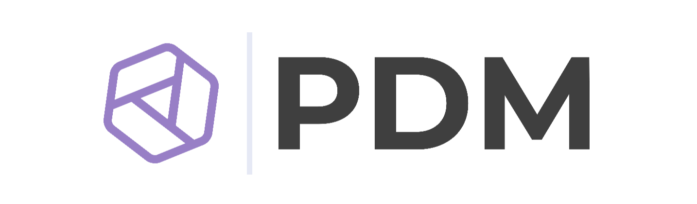

<div align="center">

</div>

# Introduction

PDM is a modern Python package manager with [PEP 582] support. It installs and manages packages
in a similar way to `npm` that doesn't need to create a virtualenv at all!

<script id="asciicast-jnifN30pjfXbO9We2KqOdXEhB" src="https://asciinema.org/a/jnifN30pjfXbO9We2KqOdXEhB.js" async></script>

[pep 582]: https://www.python.org/dev/peps/pep-0582/

## Feature highlights

- PEP 582 local package installer and runner, no virtualenv involved at all.
- Simple and relatively fast dependency resolver, mainly for large binary distributions.
- A PEP 517 build backend.
- PEP 621 project metadata.

## Installation

PDM requires Python 3.7+ to be installed. It works on multiple platforms including Windows, Linux and MacOS.

!!! note
    There is no restriction about what Python version your project is using, but installing
    PDM itself needs Python 3.7+.

### Recommended installation method

PDM requires python version 3.7 or higher.

Like Pip, PDM provides an installation script that will install PDM into an isolated environment.

**For Linux/Mac**

```bash
curl -sSL https://raw.githubusercontent.com/pdm-project/pdm/main/install-pdm.py | python -
```

**For Windows**

```powershell
(Invoke-WebRequest -Uri https://raw.githubusercontent.com/pdm-project/pdm/main/install-pdm.py -UseBasicParsing).Content | python -
```

The installer will install PDM into the user site and the location depends on the system:

- `$HOME/.local/bin` for Unix
- `%APPDATA%\Python\Scripts` on Windows

You can pass additional options to the script to control how PDM is installed:

```
usage: install-pdm.py [-h] [-v VERSION] [--prerelease] [--remove] [-p PATH] [-d DEP]

optional arguments:
  -h, --help            show this help message and exit
  -v VERSION, --version VERSION | envvar: PDM_VERSION
                        Specify the version to be installed, or HEAD to install from the main branch
  --prerelease | envvar: PDM_PRERELEASE    Allow prereleases to be installed
  --remove | envvar: PDM_REMOVE            Remove the PDM installation
  -p PATH, --path PATH | envvar: PDM_HOME  Specify the location to install PDM
  -d DEP, --dep DEP | envvar: PDM_DEPS     Specify additional dependencies, can be given multiple times
```

You can either pass the options after the script or set the env var value.


### Other installation methods

If your are on MacOS and using `homebrew`, install it by:

```bash
$ brew install pdm
```

Otherwise, to avoid messing up with the system Python environment, the most recommended way to install PDM
is via [pipx](https://pypi.org/project/pipx):

```console
$ pipx install pdm
```

Or you can install PDM into the user site with `pip`:

```console
$ pip install --user pdm
```

Install the head version of GitHub repository:

```console
$ pipx install git+https://github.com/pdm-project/pdm.git@main#egg=pdm
```

Make sure you have installed [Git LFS](https://git-lfs.github.com/) on your system.

### Enable PEP 582 globally

To make the Python interpreters aware of PEP 582 packages, one need to add the `pdm/pep582/sitecustomize.py`
to the Python library search path.

#### For Windows users

One just needs to execute `pdm --pep582`, then environment variable will be changed automatically. Don't forget
to restart the terminal session to take effect.

#### For Mac and Linux users

The command to change the environment variables can be produced by `pdm --pep582 [<SHELL>]`. If `<SHELL>`
isn't given, PDM will pick one based on some guesses.

You may want to write a line in your `.bash_profile`(or similar profiles) to make it effective when login.
For example, in bash you can do this:

```bash
$ pdm --pep582 >> ~/.bash_profile
```

Once again, Don't forget to restart the terminal session to take effect.

### Use the docker image

PDM also provides a docker image to ease your deployment flow, to use it, write a Dockerfile with following content:

```Dockerfile
FROM frostming/pdm

COPY . /app

# -- Replace with the correct path to your app's main executable
CMD ["pdm", "run", "python", "main.py"]
```

## Shell Completion

PDM supports generating completion scripts for Bash, Zsh, Fish or Powershell. Here are some common locations for each shell:

```bash
# Bash
$ pdm completion bash > /etc/bash_completion.d/pdm.bash-completion

# Zsh
# Make sure ~/.zfunc is added to fpath, before compinit.
$ pdm completion zsh > ~/.zfunc/_pdm

# Oh-My-Zsh
$ mkdir $ZSH_CUSTOM/plugins/pdm
$ pdm completion zsh > $ZSH_CUSTOM/plugins/pdm/_pdm
# Then make sure pdm plugin is enabled in ~/.zshrc

# Fish
$ pdm completion fish > ~/.config/fish/completions/pdm.fish

# Powershell
# Create a directory to store completion scripts
PS > mkdir $PROFILE\..\Completions
PS > echo @'
Get-ChildItem "$PROFILE\..\Completions\" | ForEach-Object {
    . $_.FullName
}
'@ | Out-File -Append -Encoding utf8 $PROFILE
# Generate script
PS > Set-ExecutionPolicy Unrestricted -Scope CurrentUser
PS > pdm completion powershell | Out-File -Encoding utf8 $PROFILE\..\Completions\pdm_completion.ps1
```

## Unicode and ANSI supports

PDM provides a fancy terminal UI with the help of ANSI characters and unicode emojis.
It can turn on/off automatically depending on whether it is supported on your terminal.
However, if you see any garbled characters, set env var `DISABLE_UNICODE_OUTPUT=1` to turn off it.

## Use with IDE

Now there are not built-in support or plugins for PEP 582 in most IDEs, you have to configure your tools manually.

PDM will write and store project-wide configurations in `.pdm.toml` and you are recommended to add following lines
in the `.gitignore`:

```
.pdm.toml
__pypackages__/
```

### PyCharm

Mark `__pypackages__/<major.minor>/lib` as Sources Root.

Additionally, if you want to use tools from the environment (e.g. `pytest`), you have to add the
`__pypackages__/<major.minor>/bin` directory to the `PATH` variable in the corresponding
run/debug configuration.

### VSCode

Add the following to `.vscode/settings.json`:

```json
{
  ...
  "python.autoComplete.extraPaths": ["__pypackages__/<major.minor>/lib"],
  "python.analysis.extraPaths": ["__pypackages__/<major.minor>/lib"]
}
```

[Enable PEP582 globally](https://pdm.fming.dev/#enable-pep-582-globally),
and make sure VSCode runs using the same user and shell you enabled PEP582 for.

!!! note "Cannot enable PEP582 globally?"
    If for some reason you cannot enable PEP582 globally, you can still configure each "launch" in each project:
    set the `PYTHONPATH` environment variable in your launch configuration, in `.vscode/launch.json`.
    For example, to debug your `pytest` run:

    ```json
    {
        "version": "0.2.0",
        "configurations": [
            {
                "name": "pytest",
                "type": "python",
                "request": "launch",
                "module": "pytest",
                "args": ["tests"],
                "justMyCode": false,
                "env": {"PYTHONPATH": "__pypackages__/<major.minor>/lib"}
            }
        ]
    }
    ```

    If your package resides in a `src` directory, add it to `PYTHONPATH` as well:

    ```json
    "env": {"PYTHONPATH": "src:__pypackages__/<major.minor>/lib"}
    ```

#### Task Provider

In addition, there is a [VSCode Task Provider extension][pdm task provider] available for download.

This makes it possible for VSCode to automatically detect [pdm scripts][pdm scripts] so they
can be run natively as [VSCode Tasks][vscode tasks].

[vscode tasks]: https://code.visualstudio.com/docs/editor/tasks
[pdm task provider]: https://marketplace.visualstudio.com/items?itemName=knowsuchagency.pdm-task-provider
[pdm scripts]: https://pdm.fming.dev/project/#run-scripts-in-isolated-environment

### [Seek for other IDEs or editors](usage/advanced.md#integrate-with-other-ide-or-editors)

## PDM Eco-system

[Awesome PDM](https://github.com/pdm-project/awesome-pdm) is a curated list of awesome PDM plugins and resources.
