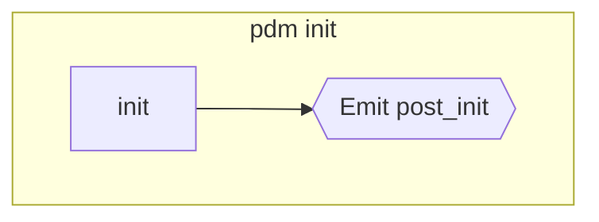
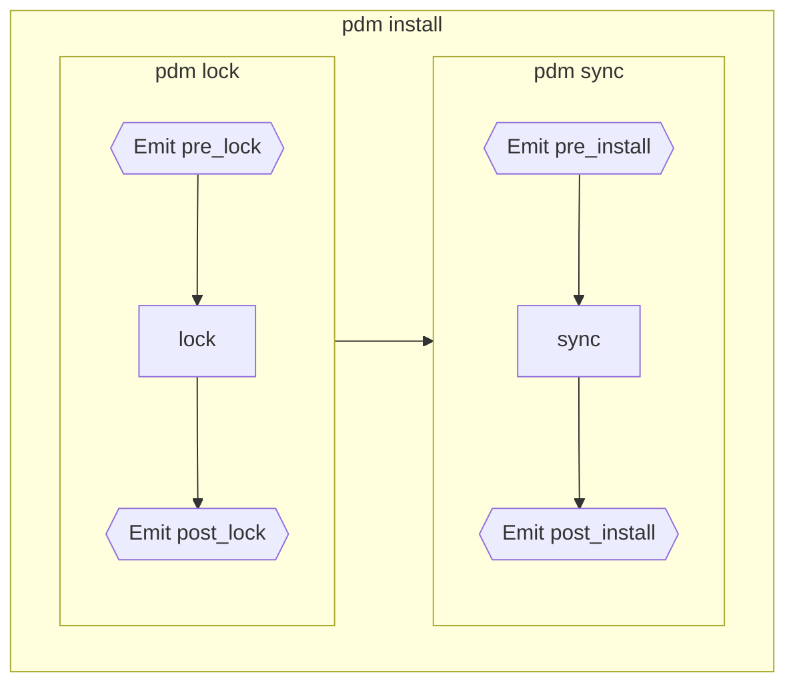
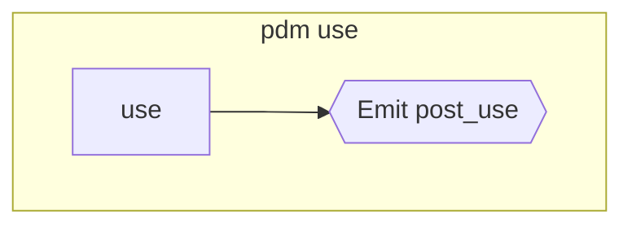
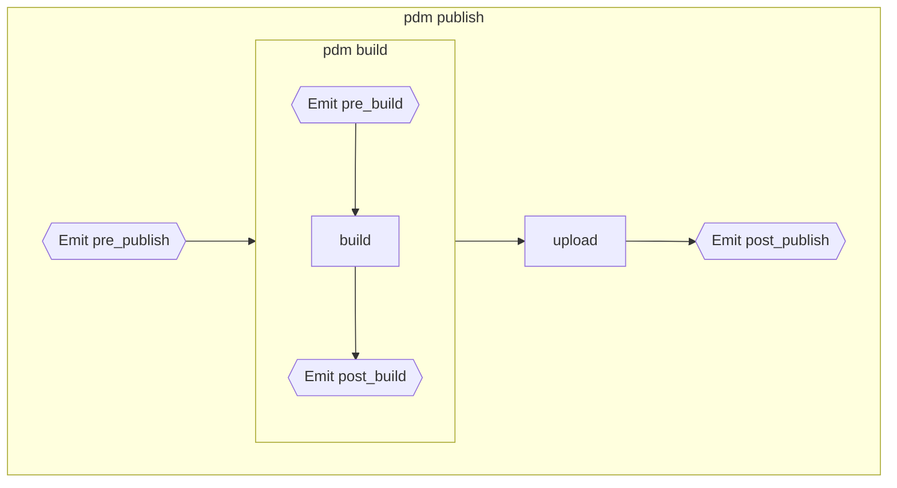
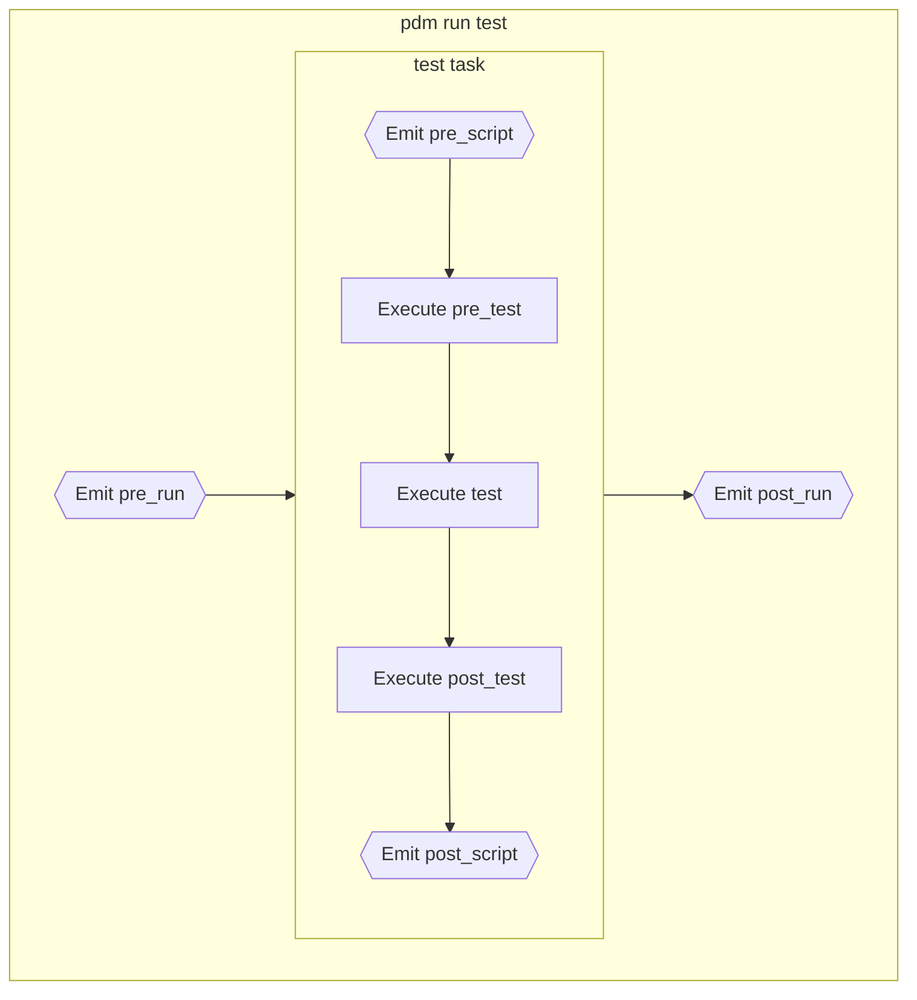
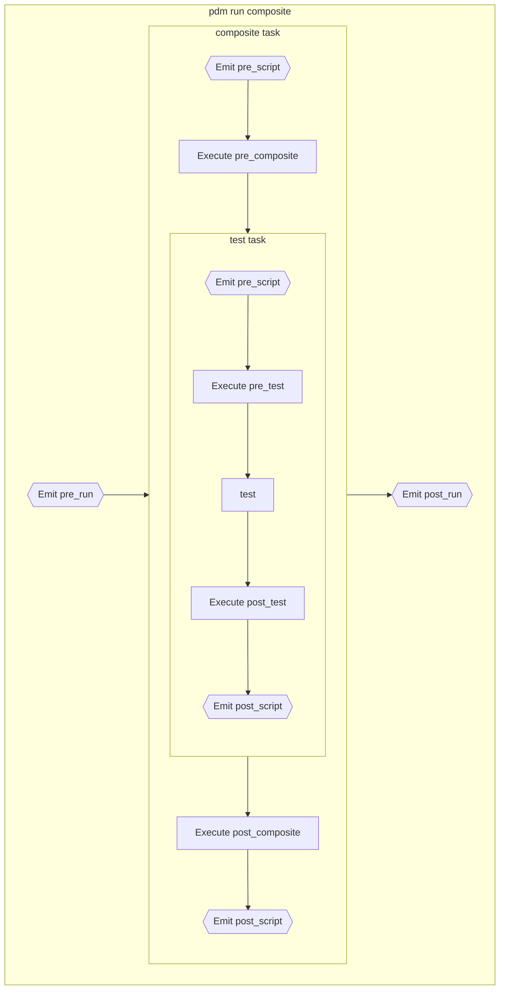
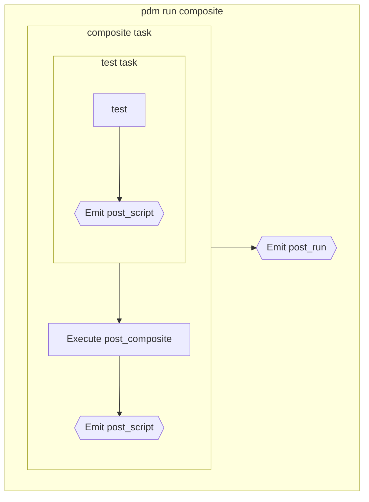

# Lifecycle and hooks

As any Python deliverable, your project will go through the different phases
of a Python project lifecycle and PDM provides commands to perform the expected tasks for those phases.

It also provides hooks attached to these steps allowing for:

- plugins to listen to the [signals][pdm.signals] of the same name.
- developers to define custom scripts with the same name.

The built-in commands are currently split into 3 groups:

- the [initialization phase](#initialization)
- the [dependencies management](#dependencies-managment).
- the [publication phase](#publication).

You will most probably need to perform some recurrent tasks between the installation and publication phases (housekeeping, linting, testing, ...)
this is why PDM lets you define your own tasks/phases using [user scripts](#user-scripts).

To provides full flexibility, PDM allows to [skip some hooks and tasks](#skipping) on demand.

## Initialization

The initialization phase should occur only once in a project lifetime by running the [`pdm init`](cli_reference.md#exec-0--init)
command to initialize an existing project (prompt to fill the `pyproject.toml` file).

They trigger the following hooks:

- [`post_init`][pdm.signals.post_init]



## Dependencies management

The dependencies management is required for the developer to be able to work and perform the following:

- `lock`: compute a lock file from the `pyproject.toml` requirements.
- `sync`: synchronize (add/remove/update) PEP582 packages from the lock file and install the current project as editable.
- `add`: add a dependency
- `remove`: remove a dependency

All those steps are directly available with the following commands:

- [`pdm lock`](cli_reference.md#exec-0--lock): execute the `lock` task
- [`pdm sync`](cli_reference.md#exec-0--sync): execute the `sync` task
- [`pdm install`](cli_reference.md#exec-0--install): execute the `sync` task, preceded from `lock` if required
- [`pdm add`](cli_reference.md#exec-0--add): add a dependency requirement, re-lock and then sync
- [`pdm remove`](cli_reference.md#exec-0--remove): remove a dependency requirement, re-lock and then sync
- [`pdm update`](cli_reference.md#exec-0--update): re-lock dependencies from their latest versions and then sync

They trigger the following hooks:

- [`pre_install`][pdm.signals.pre_install]
- [`post_install`][pdm.signals.post_install]
- [`pre_lock`][pdm.signals.pre_lock]
- [`post_lock`][pdm.signals.post_lock]



### Switching Python version

This is a special case in dependency management:
you can switch the current Python version using [`pdm use`](cli_reference.md#exec-0--use)
and it will emit the [`post_use`][pdm.signals.post_use] signal with the new Python interpreter.



## Publication

As soon as you are ready to publish your package/library, you will require the publication tasks:

- `build`: build/compile assets requiring it and package everything into a Python package (sdist, wheel)
- `upload`: upload/publish the package to a remote PyPI index

All those steps are available with the following commands:

- [`pdm build`](cli_reference.md#exec-0--build)
- [`pdm publish`](cli_reference.md#exec-0--publish)

They trigger the following hooks:

- [`pre_publish`][pdm.signals.pre_publish]
- [`post_publish`][pdm.signals.post_publish]
- [`pre_build`][pdm.signals.pre_build]
- [`post_build`][pdm.signals.post_build]




Execution will stop at first failure, hooks included.

## User scripts

[User scripts are detailed in their own section](scripts.md) but you should know that:

- each user script can define a `pre_*` and `post_*` script, including composite scripts.
- each `run` execution will trigger the [`pre_run`][pdm.signals.pre_run] and [`post_run`][pdm.signals.post_run] hooks
- each script execution will trigger the [`pre_script`][pdm.signals.pre_script] and [`post_script`][pdm.signals.post_script] hooks

Given the following `scripts` definition:

```toml
[tool.pdm.scripts]
pre_script = ""
post_script = ""
pre_test = ""
post_test = ""
test = ""
pre_composite = ""
post_composite = ""
composite = {composite: ["test"]}
```

a `pdm run test` will have the following lifecycle:



while `pdm run composite` will have the following:



## Skipping

It is possible to control which task and hook runs for any built-in command as well as custom user scripts
using the `--skip` option.

It accepts a comma-separated list of hooks/task names to skip
as well as the predefined `:all`, `:pre` and `:post` shortcuts
respectively skipping all hooks, all `pre_*` hooks and all `post_*` hooks.
You can also provide the skip list in `PDM_SKIP_HOOKS` environment variable
but it will be overridden as soon as the `--skip` parameter is provided.

Given the previous script block, running `pdm run --skip=:pre,post_test composite` will result in the following reduced lifecycle:


