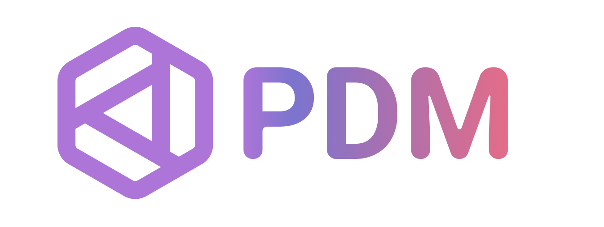

<div align="center">

</div>

# Introduction

PDM, as described, is a modern Python package and dependency manager supporting the latest PEP standards. But it is more than a package manager. It boosts your development workflow in various aspects.

<script id="asciicast-jnifN30pjfXbO9We2KqOdXEhB" src="https://asciinema.org/a/jnifN30pjfXbO9We2KqOdXEhB.js" async></script>

## Feature highlights

- Simple and fast dependency resolver, mainly for large binary distributions.
- A [PEP 517] build backend.
- [PEP 621] project metadata.
- Flexible and powerful plug-in system.
- Versatile user scripts.
- Install Pythons using [indygreg's python-build-standalone](https://github.com/indygreg/python-build-standalone).
- Opt-in centralized installation cache like [pnpm].

[pep 517]: https://www.python.org/dev/peps/pep-0517
[pep 621]: https://www.python.org/dev/peps/pep-0621
[pnpm]: https://pnpm.io/motivation#saving-disk-space-and-boosting-installation-speed

## Installation

PDM requires Python 3.8+ to be installed. It works on multiple platforms including Windows, Linux and macOS.

!!! note
    You can still have your project working on lower Python versions, read how to do it [here](usage/project.md#working-with-python-37).

### Recommended installation method

PDM requires python version 3.8 or higher.

Like Pip, PDM provides an installation script that will install PDM into an isolated environment.

=== "Linux/Mac"

    ```bash
    curl -sSL https://pdm-project.org/install-pdm.py | python3 -
    ```

=== "Windows"

    ```powershell
    (Invoke-WebRequest -Uri https://pdm-project.org/install-pdm.py -UseBasicParsing).Content | py -
    ```

!!! note
    On Windows, if you do not have the optional ``py`` launcher installed (including if you installed Python through the Microsoft store), replace ``py`` with ``python``.

For security reasons, you should verify the checksum of `install-pdm.py`.
It can be downloaded from [install-pdm.py.sha256](https://pdm-project.org/install-pdm.py.sha256).

For example, on Linux/Mac:

```bash
curl -sSLO https://pdm-project.org/install-pdm.py
curl -sSL https://pdm-project.org/install-pdm.py.sha256 | shasum -a 256 -c -
# Run the installer
python3 install-pdm.py [options]
```

The installer will install PDM into the user site and the location depends on the system:

- `$HOME/.local/bin` for Unix
- `$HOME/Library/Python/<version>/bin` for MacOS
- `%APPDATA%\Python\Scripts` on Windows

You can pass additional options to the script to control how PDM is installed:

```bash
usage: install-pdm.py [-h] [-v VERSION] [--prerelease] [--remove] [-p PATH] [-d DEP]

optional arguments:
  -h, --help            show this help message and exit
  -v VERSION, --version VERSION | envvar: PDM_VERSION
                        Specify the version to be installed, or HEAD to install from the main branch
  --prerelease | envvar: PDM_PRERELEASE    Allow prereleases to be installed
  --remove | envvar: PDM_REMOVE            Remove the PDM installation
  -p PATH, --path PATH | envvar: PDM_HOME  Specify the location to install PDM
  -d DEP, --dep DEP | envvar: PDM_DEPS     Specify additional dependencies, can be given multiple times
```

You can either pass the options after the script or set the env var value.

### Other installation methods

=== "Homebrew"

    ```bash
    brew install pdm
    ```

=== "Scoop"

    ```
    scoop bucket add frostming https://github.com/frostming/scoop-frostming.git
    scoop install pdm
    ```

=== "uv"

    ```bash
    uv tool install pdm
    ```

=== "pipx"

    ```bash
    pipx install pdm
    ```

    Install the head version of GitHub repository.
    Make sure you have installed [Git LFS](https://git-lfs.github.com/) on your system.

    ```bash
    pipx install git+https://github.com/pdm-project/pdm.git@main#egg=pdm
    ```

    To install PDM with all features:

    ```bash
    pipx install pdm[all]
    ```

    See also: <https://pypa.github.io/pipx/>

=== "pip"

    ```bash
    pip install --user pdm
    ```

=== "asdf"

    Assuming you have [asdf](https://asdf-vm.com/) installed.
    ```
    asdf plugin add pdm
    asdf local pdm latest
    asdf install pdm
    ```

=== "inside project"

    By copying the [Pyprojectx](https://pyprojectx.github.io/) wrapper scripts to a project, you can install PDM as
    (npm-style) dev dependency inside that project. This allows different projects/branches to use different PDM versions.

    To [initialize a new or existing project](https://pyprojectx.github.io/usage/#initialize-a-new-or-existing-project),
    cd into the project folder and:

    === "Linux/Mac"

        ```
        curl -LO https://github.com/pyprojectx/pyprojectx/releases/latest/download/wrappers.zip && unzip wrappers.zip && rm -f wrappers.zip
        ./pw --add pdm
        ```

    === "Windows"

        ```powershell
        Invoke-WebRequest https://github.com/pyprojectx/pyprojectx/releases/latest/download/wrappers.zip -OutFile wrappers.zip; Expand-Archive -Path wrappers.zip -DestinationPath .; Remove-Item -Path wrappers.zip
        .\pw --add pdm
        ```

    When installing pdm with this method, you need to run all `pdm` commands through the `pw` wrapper:

    === "Linux/Mac/Windows"

        ```
        ./pw pdm install
        ```

### Update the PDM version

```bash
pdm self update
```

## Packaging Status

[](https://repology.org/project/pdm/versions)

## Shell Completion

PDM supports generating completion scripts for Bash, Zsh, Fish or Powershell. Here are some common locations for each shell:

=== "Bash"

    ```bash
    pdm completion bash > /etc/bash_completion.d/pdm.bash-completion
    ```

=== "Zsh"

    ```bash
    # Make sure ~/.zfunc is added to fpath, before compinit.
    pdm completion zsh > ~/.zfunc/_pdm
    ```

    Oh-My-Zsh:

    ```bash
    mkdir $ZSH_CUSTOM/plugins/pdm
    pdm completion zsh > $ZSH_CUSTOM/plugins/pdm/_pdm
    ```

    Then make sure pdm plugin is enabled in ~/.zshrc

=== "Fish"

    ```bash
    pdm completion fish > ~/.config/fish/completions/pdm.fish
    ```

=== "Powershell"

    ```ps1
    # Create a directory to store completion scripts
    mkdir $PROFILE\..\Completions
    echo @'
    Get-ChildItem "$PROFILE\..\Completions\" | ForEach-Object {
        . $_.FullName
    }
    '@ | Out-File -Append -Encoding utf8 $PROFILE
    # Generate script
    Set-ExecutionPolicy Unrestricted -Scope CurrentUser
    pdm completion powershell | Out-File -Encoding utf8 $PROFILE\..\Completions\pdm_completion.ps1
    ```

## Virtualenv and PEP 582

PDM offers experimental support for [PEP 582](https://www.python.org/dev/peps/pep-0582/) as an opt-in feature, in addition to virtualenv management. Although [the Python Steering Council has rejected PEP 582][rejected], you can still test it out using PDM.

To learn more about the two modes, refer to the relevant chapters on [Working with virtualenv](usage/venv.md) and [Working with PEP 582](usage/pep582.md).

[rejected]: https://discuss.python.org/t/pep-582-python-local-packages-directory/963/430

## PDM Eco-system

[Awesome PDM](https://github.com/pdm-project/awesome-pdm) is a curated list of awesome PDM plugins and resources.

## Sponsors

<p align="center">
    <a href="https://cdn.jsdelivr.net/gh/pdm-project/sponsors/sponsors.svg">
        
    </a>
</p>
