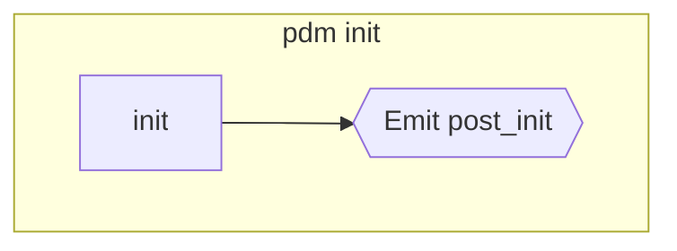
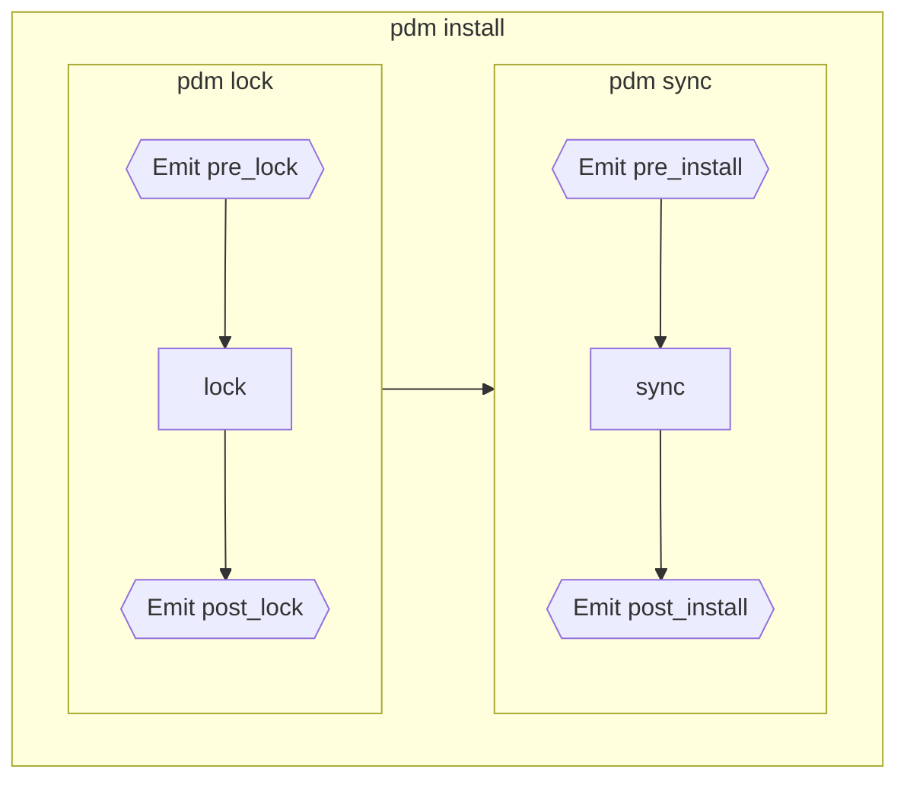
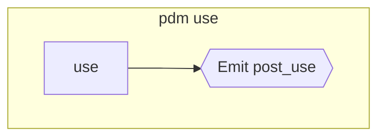
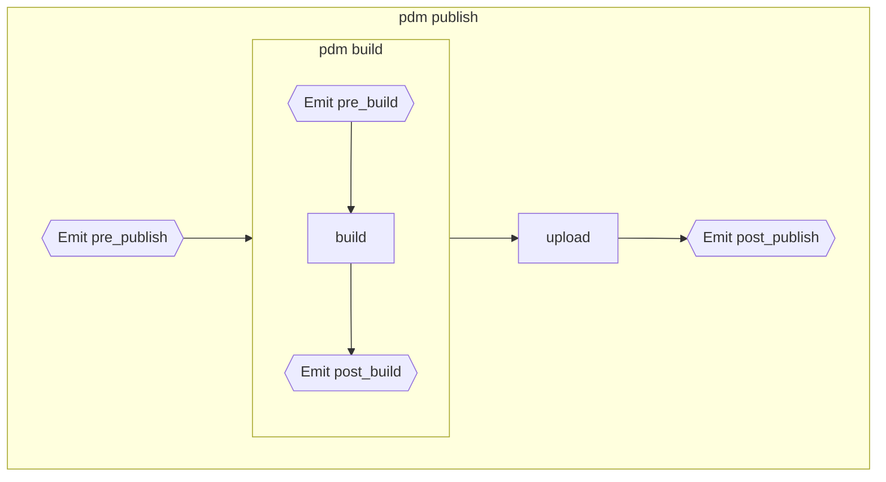
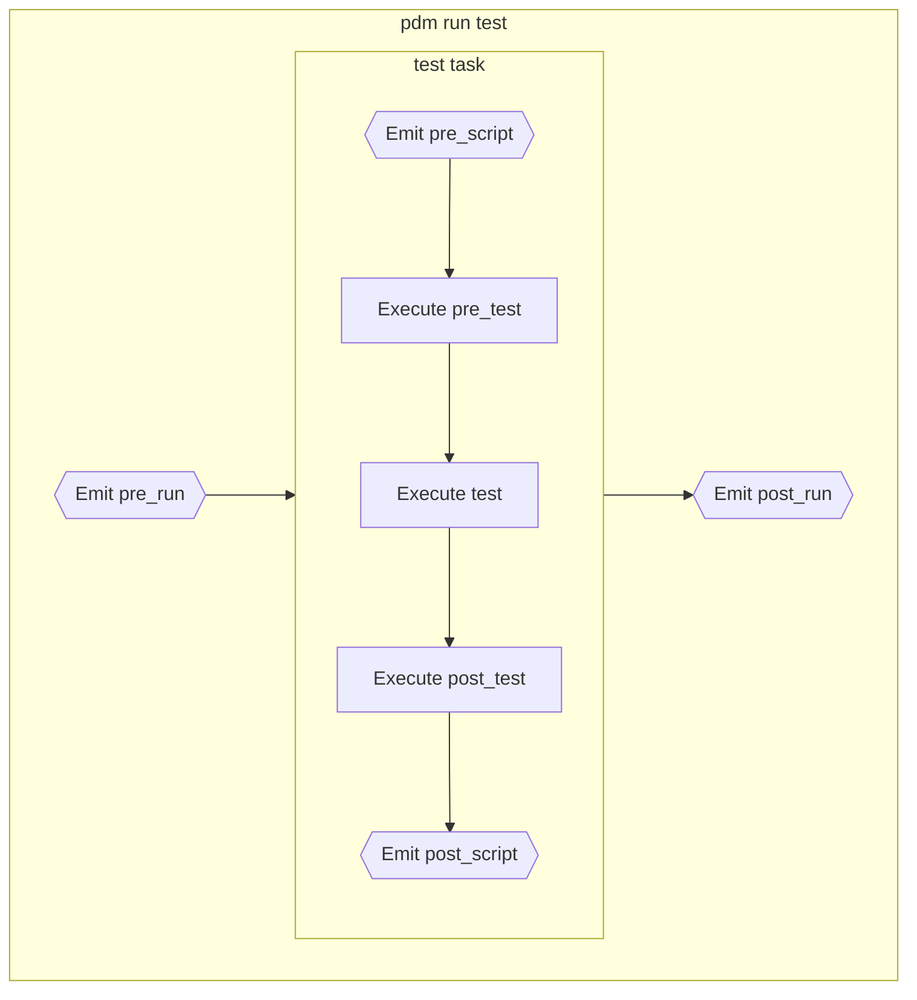
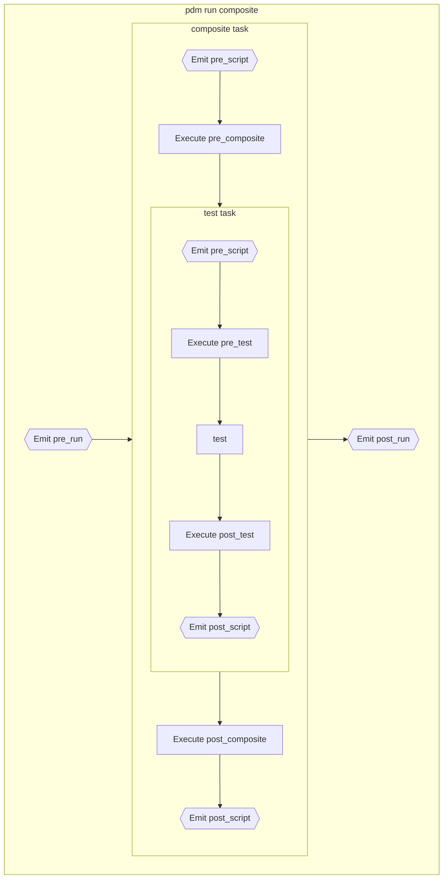
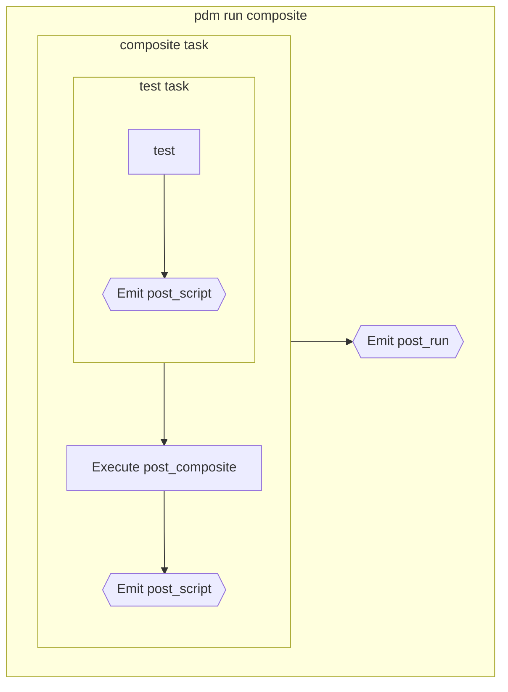

# 生命周期与钩子

与任何 Python 交付件一样，您的项目将经历 Python 项目生命周期的不同阶段，并且 PDM 提供了执行这些阶段所需任务的命令。

它还提供了附加到这些步骤的钩子，允许：

- 插件监听相同名称的 [信号][pdm.signals]。
- 开发者定义具有相同名称的自定义脚本。

此外，`pre_invoke` 信号在调用任何命令之前发出，允许插件在此之前修改项目或选项。

内置命令当前分为 3 组：

- [初始化阶段](#initialization)
- [依赖管理](#dependencies-management)
- [发布阶段](#publication)

您可能需要在安装和发布阶段之间执行一些重复性任务（清理，代码检查，测试等），这就是为什么PDM 让您使用 [用户脚本](#user-scripts) 定义自己的任务/阶段的原因。

为了提供完全的灵活性，PDM 允许 [跳过某些钩子和任务](#skipping)。

## Initialization

初始化阶段应该在项目生命周期中仅发生一次，通过运行 [`pdm init`](../reference/cli.md#init) 命令来初始化现有项目（提示填写 `pyproject.toml` 文件）。

它们触发以下钩子：

- [`post_init`][pdm.signals.post_init]



## Dependencies management

依赖管理对于开发者能够工作并执行以下操作是必需的：

- `lock`：从 `pyproject.toml` 的依赖计算一个锁定文件。
- `sync`：同步（添加/删除/更新）PEP582 包，从锁定文件中安装当前项目为可编辑状态。
- `add`：添加一个依赖
- `remove`：移除一个依赖

所有这些步骤都直接可用，具体命令如下：

- [`pdm lock`](../reference/cli.md#lock): 执行 `lock` 任务
- [`pdm sync`](../reference/cli.md#sync): 执行 `sync` 任务
- [`pdm install`](../reference/cli.md#install): 执行 `sync` 任务，如果需要，则在此之前执行 `lock` 任务
- [`pdm add`](../reference/cli.md#add): 添加一个依赖要求，重新锁定，然后同步
- [`pdm remove`](../reference/cli.md#remove): 删除一个依赖要求，重新锁定，然后同步
- [`pdm update`](../reference/cli.md#update): 从它们的最新版本重新锁定依赖项，然后同步

它们触发以下钩子：

- [`pre_install`][pdm.signals.pre_install]
- [`post_install`][pdm.signals.post_install]
- [`pre_lock`][pdm.signals.pre_lock]
- [`post_lock`][pdm.signals.post_lock]



### 切换 Python 版本

这是依赖管理中的一个特殊情况：
您可以使用 [`pdm use`](../reference/cli.md#use) 切换当前的 Python 版本，并且它将发出具有新 Python 解释器的 [`post_use`][pdm.signals.post_use] 信号。



## 发布

一旦您准备好发布您的包/库，您将需要执行发布任务：

- `build`: 构建/编译需要的资产，并将所有内容打包到 Python 包中（sdist，wheel）
- `upload`: 将包上传/发布到远程 PyPI 索引

所有这些步骤都可用以下命令：

- [`pdm build`](../reference/cli.md#build)
- [`pdm publish`](../reference/cli.md#publish)

它们触发以下钩子：

- [`pre_publish`][pdm.signals.pre_publish]
- [`post_publish`][pdm.signals.post_publish]
- [`pre_build`][pdm.signals.pre_build]
- [`post_build`][pdm.signals.post_build]



执行将在第一个失败时停止，包括钩子。

## 用户脚本

[用户脚本在其自己的部分中详细说明](scripts.md) 但您应该知道：

- 每个用户脚本可以定义一个 `pre_*` 和 `post_*` 脚本，包括复合脚本。
- 每次 `run` 执行将触发 [`pre_run`][pdm.signals.pre_run] 和 [`post_run`][pdm.signals.post_run] 钩子
- 每次脚本执行将触发 [`pre_script`][pdm.signals.pre_script] 和 [`post_script`][pdm.signals.post_script] 钩子

给定以下 scripts 定义：

```toml
[tool.pdm.scripts]
pre_script = ""
post_script = ""
pre_test = ""
post_test = ""
test = ""
pre_composite = ""
post_composite = ""
composite = {composite = ["test"]}
```

`pdm run test` 将具有以下生命周期：



而 `pdm run composite` 将具有以下生命周期：



## 跳过

可以使用 `--skip` 选项控制任何内置命令以及自定义用户脚本运行哪些任务和钩子。

它接受以逗号分隔的钩子/任务名称列表以跳过
以及预定义的 `:all`，`:pre` 和 `:post` 快捷方式
分别跳过所有钩子，所有 `pre_*` 钩子和所有 `post_*` 钩子。
您还可以在 `PDM_SKIP_HOOKS` 环境变量中提供跳过列表，
但一旦提供 `--skip` 参数，它将被覆盖。

给定上一个脚本块，运行 `pdm run --skip=:pre,post_test composite` 将导致以下简化的生命周期：


